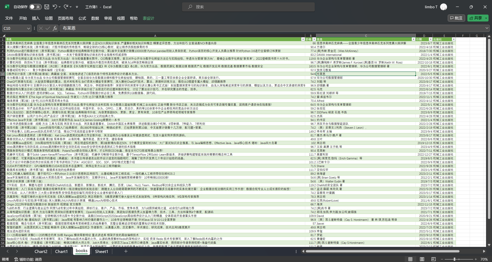

# 题解

## 6.1

已实现爬取到数据库中，代码可见codes文件夹（没改书上的，自己重写了另一个版本)

数据库可显示韩语等

## 6.2

比如优点：

1）集成，模块化，方便，省力

2）异步，可调节并发量

比如缺点：

1）不适合大型的爬取，可能不能满足某些功能的需要

2）可能不好理解其内部逻辑，属于厚封装框架

## 6.3

这几个网站很有参考价值：

[Scrapy 入门教程 | 菜鸟教程 (runoob.com)](https://www.runoob.com/w3cnote/scrapy-detail.html)

[Scrapy爬虫框架，入门案例（非常详细）_scrapy crawl-CSDN博客](https://blog.csdn.net/ck784101777/article/details/104468780)

## 6.4

已完成用scrapy框架爬取当当网计算机类书籍信息的首页，可在**codes/6.4/project1**下运行`scrapy crawl ddw`来测试我的代码

这是导出的books.csv输入Excel的表格。

