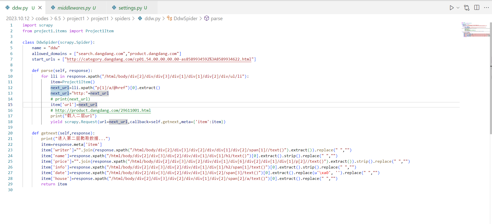
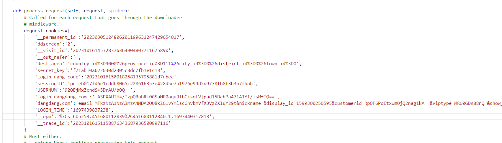
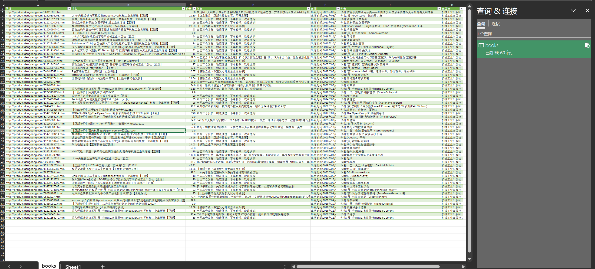
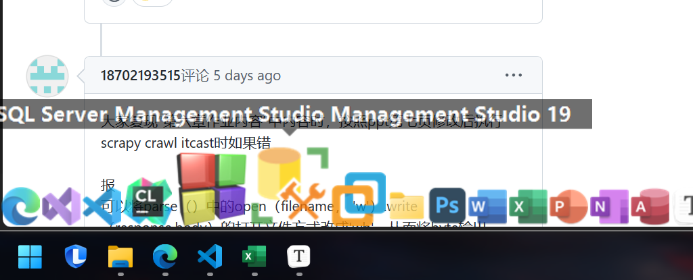
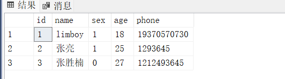
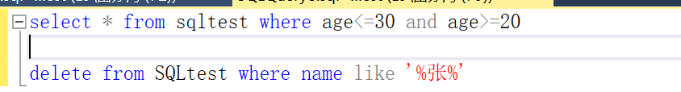
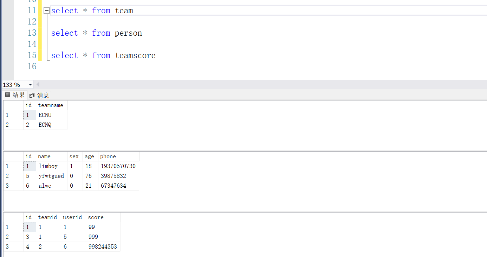
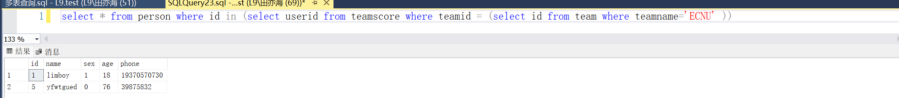
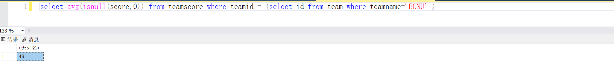

# 题解

## 6.1

已实现爬取到数据库中，代码可见codes文件夹（没改书上的，自己重写了另一个版本)

数据库可显示韩语等

## 6.2

比如优点：

1）集成，模块化，方便，省力

2）异步，可调节并发量

比如缺点：

1）不适合大型的爬取，可能不能满足某些功能的需要

2）可能不好理解其内部逻辑，属于厚封装框架

## 6.3

这几个网站很有参考价值：

[Scrapy 入门教程 | 菜鸟教程 (runoob.com)](https://www.runoob.com/w3cnote/scrapy-detail.html)

[Scrapy爬虫框架，入门案例（非常详细）_scrapy crawl-CSDN博客](https://blog.csdn.net/ck784101777/article/details/104468780)

## 6.4

已完成用scrapy框架爬取当当网计算机类书籍信息的首页，可在**codes/6.4/project1**下运行`scrapy crawl ddw`来测试我的代码

这是导出的books.csv输入Excel的表格。

## 6.5

在6.4基础上，做一定修改，进入二级网页爬取详细信息。

运行方式请在方案下`scrapy crawl ddw`

 由于数据量较大，可能需要等待5分钟左右才会运行完毕。

比如spider: ddw.py,

实现逻辑为`parse`爬取全部的二级网页的url，`getnext`方法处理网页的xml信息并返回

此外，由于当当网存在一定的反爬机制，还需要登陆账号

所以在setting.py中设置了较慢的爬取速度，

在middlewares.py中设置了定义的cookie（包含我的账号信息）

这是爬取的books.csv导入excel的表格，包含url，书名，价格，简介，作者，出版社，日期 等

## 7.1

我用的是SSMS

## 7.2

## 7.3

## 7.4,5

## 7.6

## 7.8

## 7.9

`select * from person where id in (select userid from teamscore where teamid = (select id from team where teamname='ECNU' ))`

## 7.10

`select avg(isnull(score,0)) from teamscore where teamid = (select id from team where teamname='ECNU' )`

