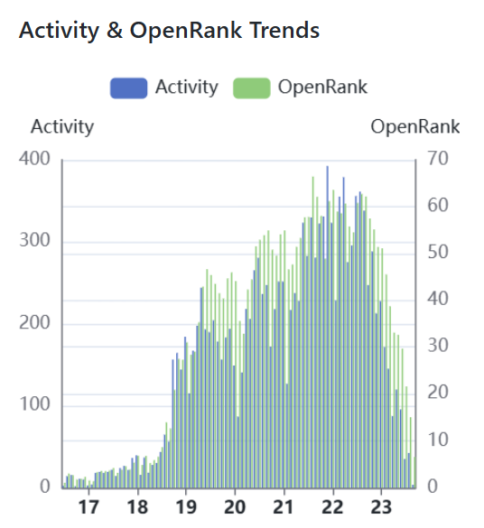
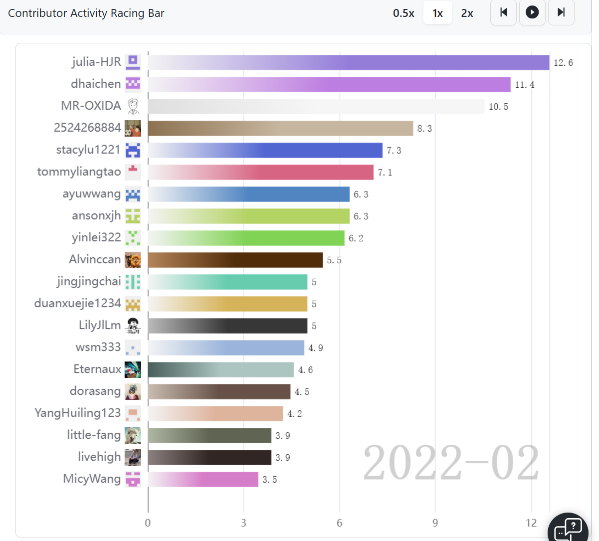
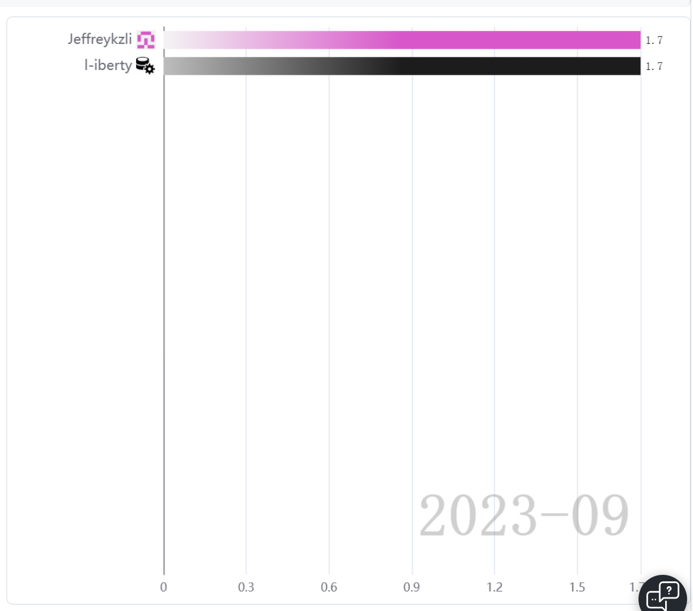
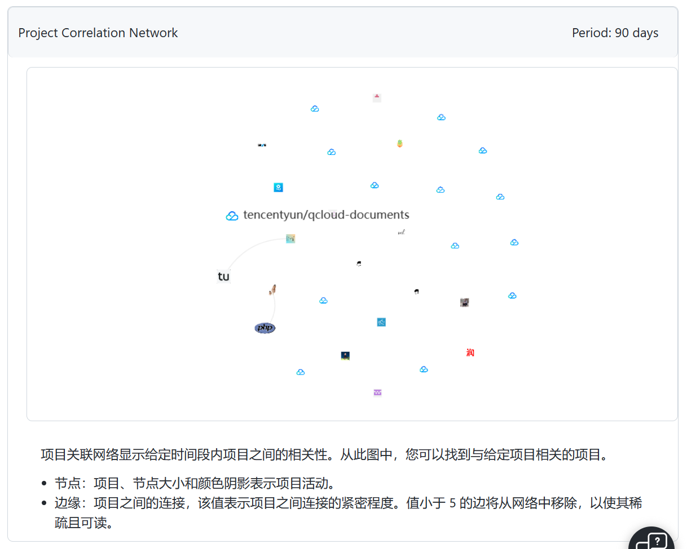
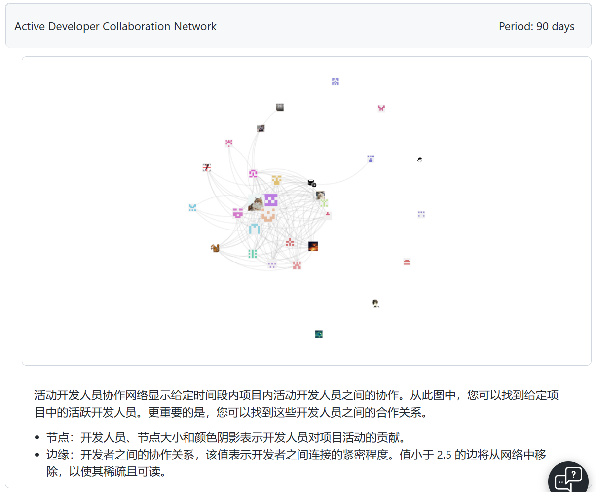

# 使用hypercrx插件来观察一个仓库的数据

## 仓库链接

[tencentyun/qcloud-documents: 腾讯云官方文档 (github.com)](https://github.com/tencentyun/qcloud-documents)

根据我的观察，这个仓库是放了腾讯云的一些文档资料，比如产品说明及用法等

## 一些特征

这是活动以及openrank趋势，其在22年左右达到了峰值，在22年及以后有较大下降趋势

（我在网上查阅了相关新闻，并没有什么要事发生。推测可能是近期没有推出新产品或说明已经较为完全）

上图为当月活跃情况

这张是表述相关性，可以看出此项目与其他项目的相关性可能并不大

此图为90天内项目开发人员之间的协作。

我们可以看出，`dhaichen`,`langliverygood`,`dssxxx`在很大程度上参加了协作，贡献度均为20以上。

## 总结

通过hypercrx，我们可以很方便的将数据可视化，从历史提交等信息中迅速发现github上某个仓库的总活跃趋势、项目间关系、各个人员的贡献与协作关系，这是一件很有趣的事，同时也有较大的实用价值