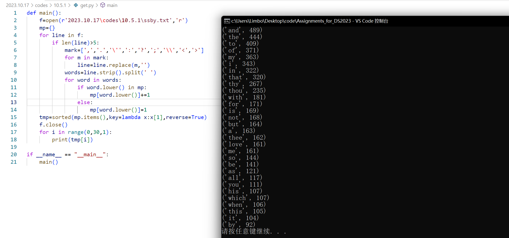
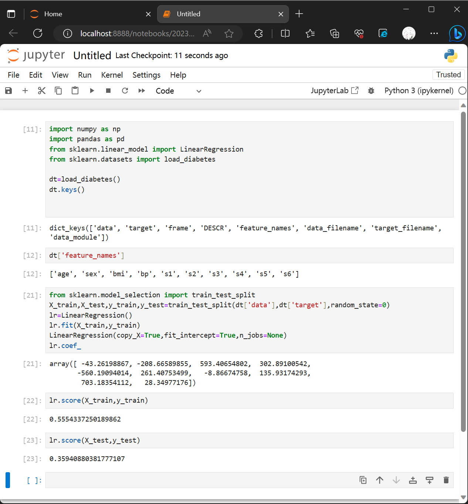
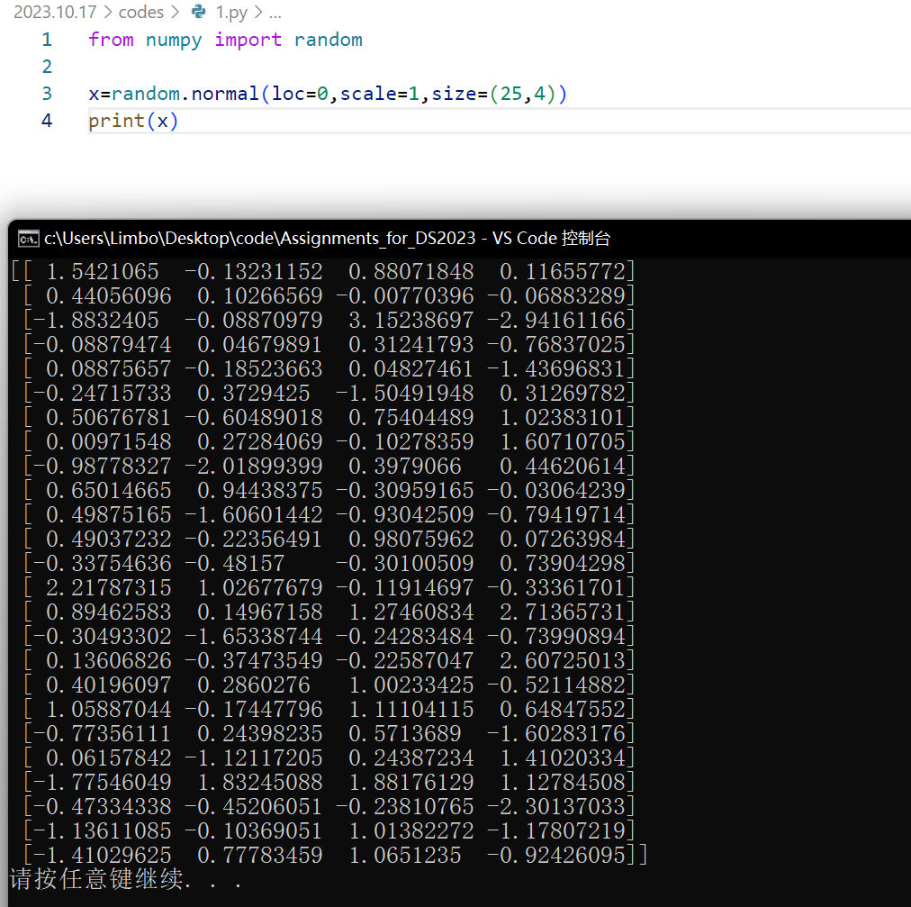
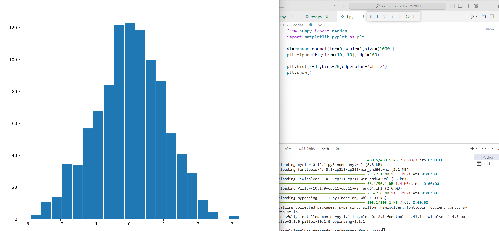
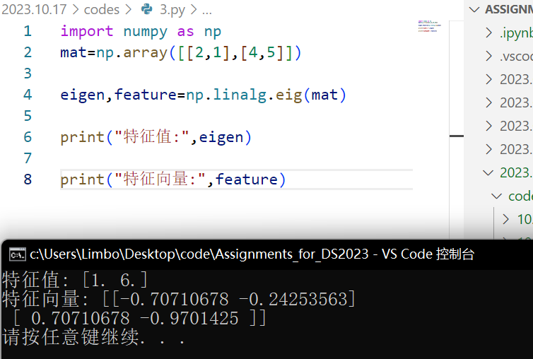
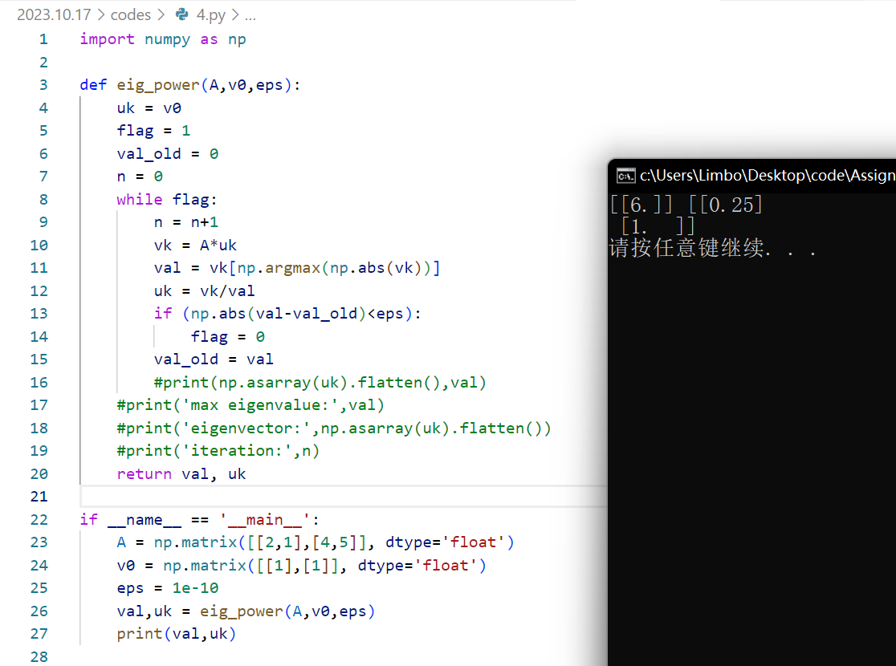
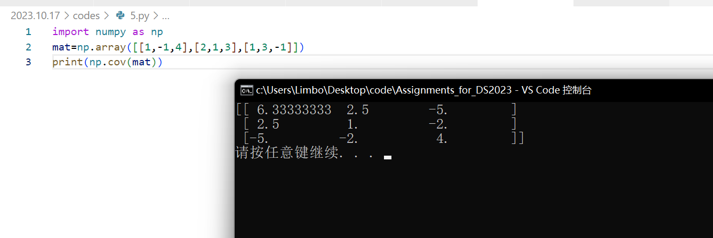
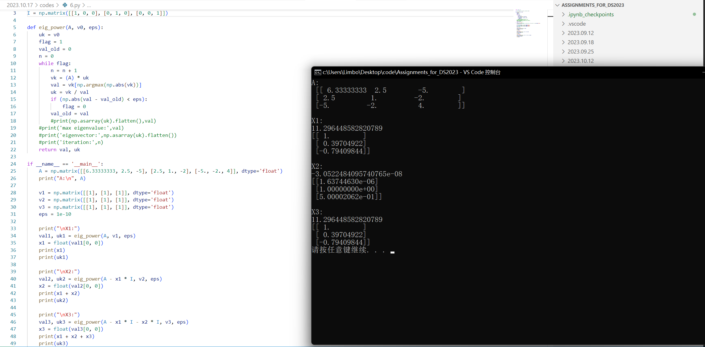

# 题解

## 10.5.1实践

十四行诗可在这个网站找到：[Shakespeare's Sonnets. Plain text 1-154. (shakespeares-sonnets.com)](https://shakespeares-sonnets.com/Archive/allsonn.htm)

运行结果如图

## 10.5.2实践

安装jupyter、numpy、pandas、sklearn（我均使用pip安装）后，即可实现代码

其中load_boston已从自带数据包中删除，所以我使用的是diabetes（一个糖尿病数据集）

得到线性回归在训练集上的精确度大概为55%，而在测试集上的精确度大概为36%

## 1

## 2

由于100个数据太少了所以我生成了1000个数据

## 3

## 4

参考这篇文章讲的很详细：[矩阵特征值计算的python实现(1)——幂法与反幂法_矩阵求特征值 python算法-CSDN博客](https://blog.csdn.net/xfijun/article/details/109371433)

## 5

注意cov是以一列为一个样本，每行为不同的随机变量（维度），来求协方差。

如果不一致，则需要用`np.cov(mat,rowvar=False)`

## 6

结合4，使用了偏移法来求出非主特征值。

