# 题解

## 手写汉字识别

### 参考

我的实现也参考了这篇文章，很详尽。

[【模型+代码/保姆级教程】使用Pytorch实现手写汉字识别_pytorch 文字识别-CSDN博客](https://blog.csdn.net/Katock_Cricket/article/details/129674463)

### 模型

参考资料使用了EfficientNetV2_s进行训练，主要是电脑性能也没那么强，VGG19训得实在太慢了

[EfficientNetV2网络详解_太阳花的小绿豆的博客-CSDN博客](https://blog.csdn.net/qq_37541097/article/details/116933569)

### 环境

RTX3060，显存6G，内存16G

### 结构

除了仓库上的文件，我把训练中保存的参数文件、以及处理过后的手写汉字数据集资料，保存在了D盘

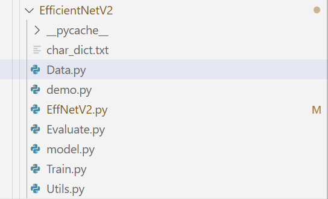

其中，char_dict是汉字-gb2312编码对照表

Utils.py用于生成图片的路径，保存在数据处，方便读取数据

Data.py存放数据集结构

model.py存放EfficientNetV2模型的代码

Train.py训练: 在log文件夹下寻找参数文件，取最大的那个继续训练，每训练一组就保存为一个新的log文件

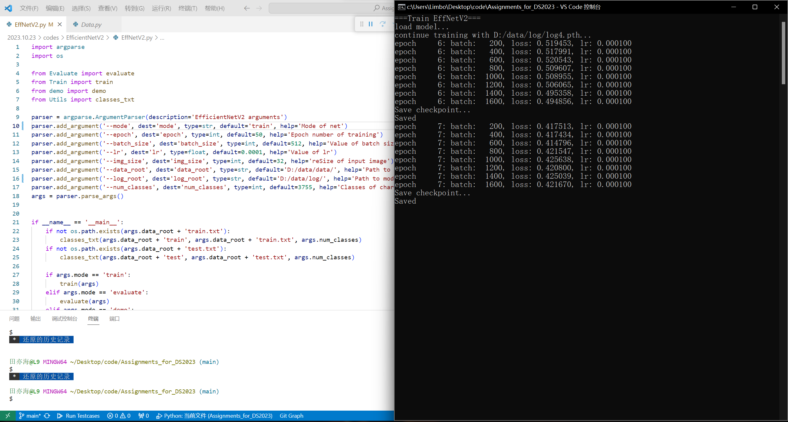

Evaluate.py测试评估（使用最新的训练结果）

最终的准确率实际上为85%

demo.py展示几个预测结果

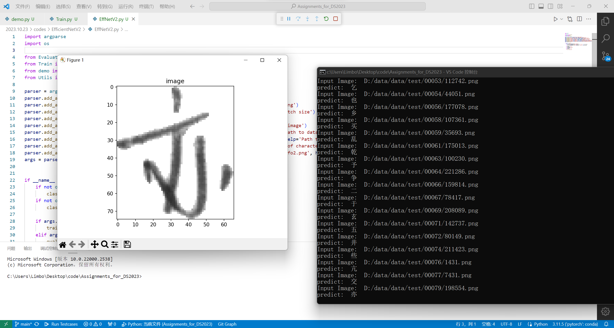

EffNetV2.py处可以运行代码，通过修改其中的参数来进行训练、评估、展示，还可修改训练参数（batch_size，文件路径等）

## 11.5

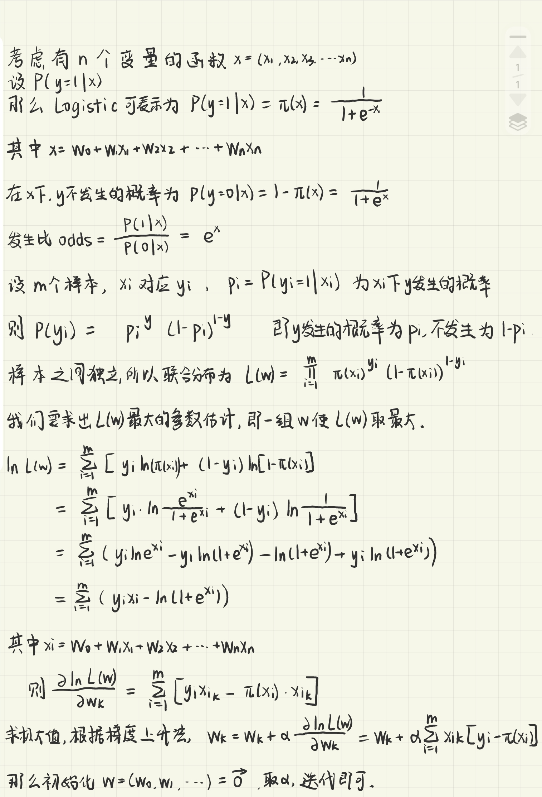

## 11.6

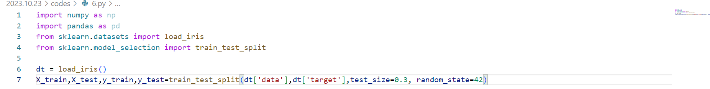

如图

## 11.7

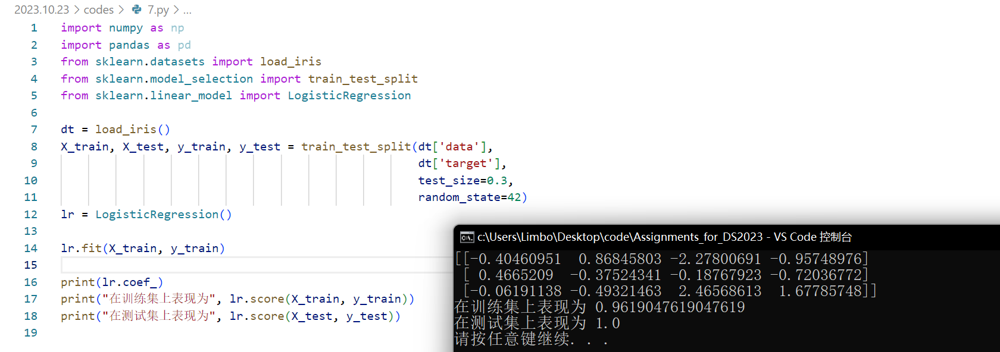

rt

## 11.8

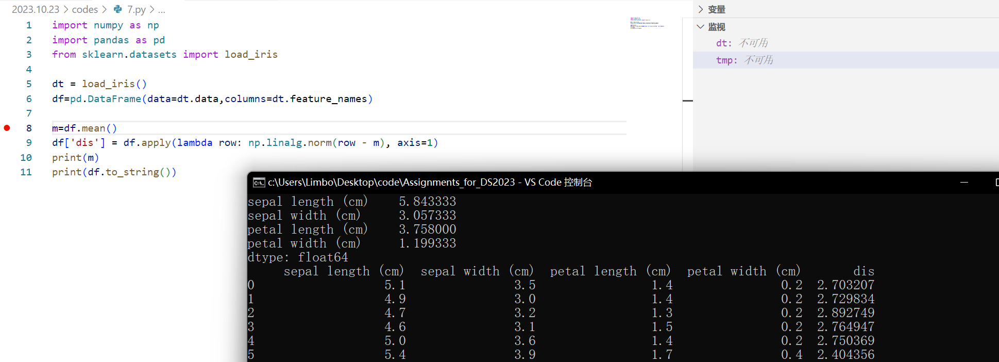

## 11.9

取k=3,选取了`petal length` `petal width`两个维度的数据，聚类效果很好。

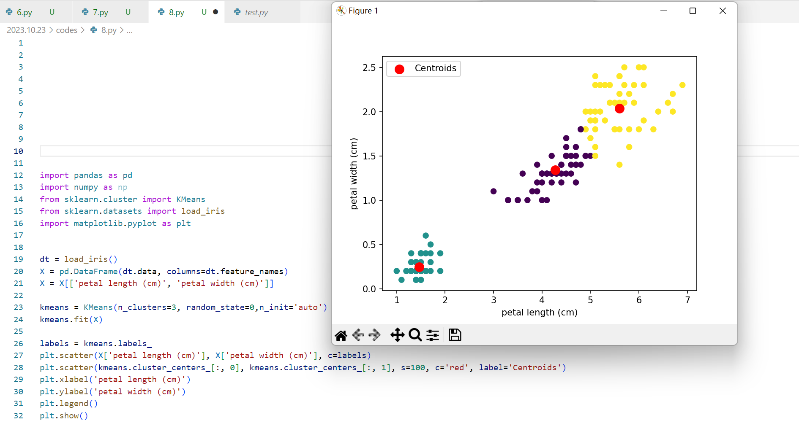

## 12.6.实践，手写数字识别

基于参考网上有很多对手写数字识别的代码，我在此先实现了手写数字的识别，稍后补全为手写汉字识别。

（已经补全了）

调整batch_size=1024后，GPU显存大概占用4.5G（共6G）

（好像训得挺快的（？））

运行demo.py进行训练，如图：

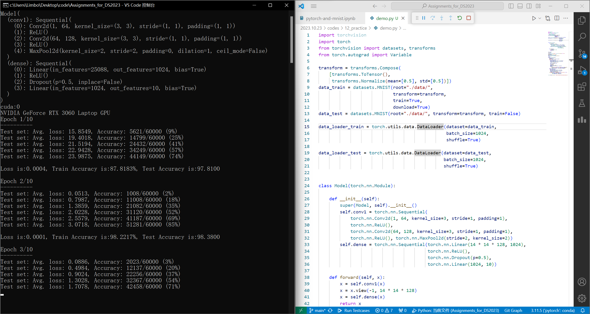

运行test.py进行测试，如图：

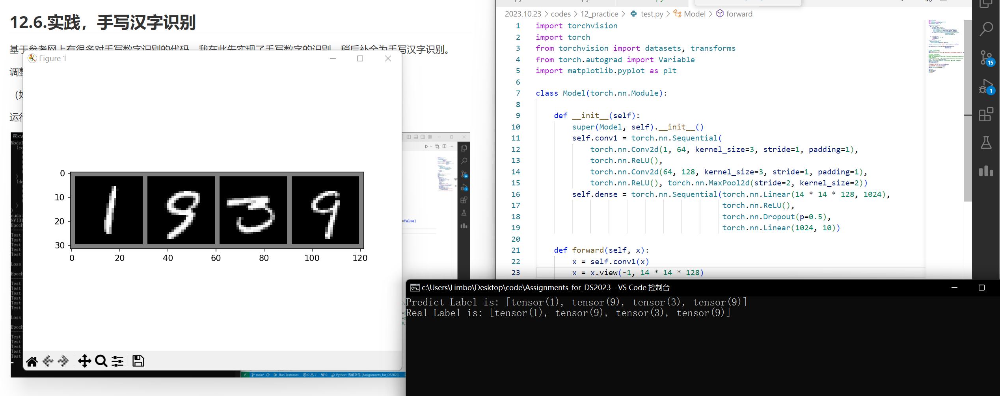

很有趣。

## 12.4

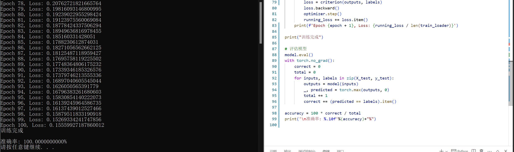

## 12.5

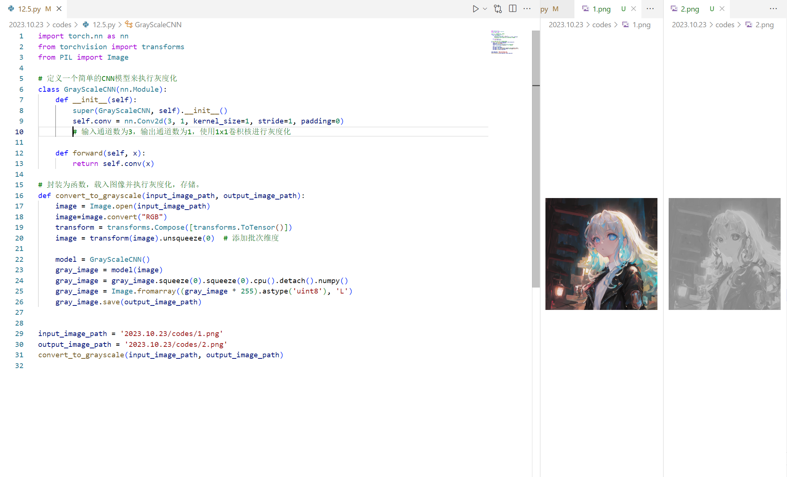

## 12.7 12.8

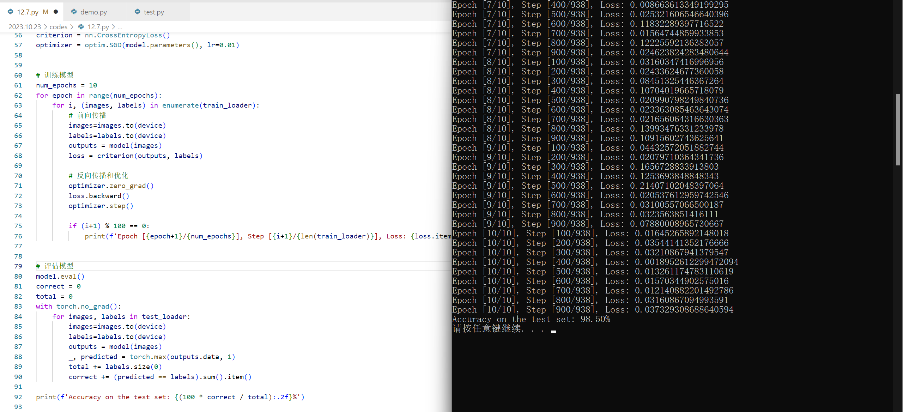
