# 题解

## 13.1

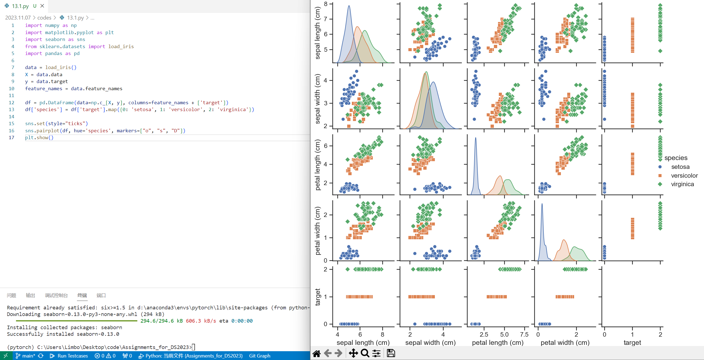

## 13.2

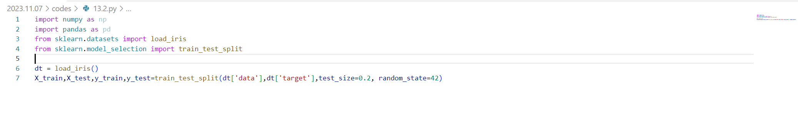

## 13.3

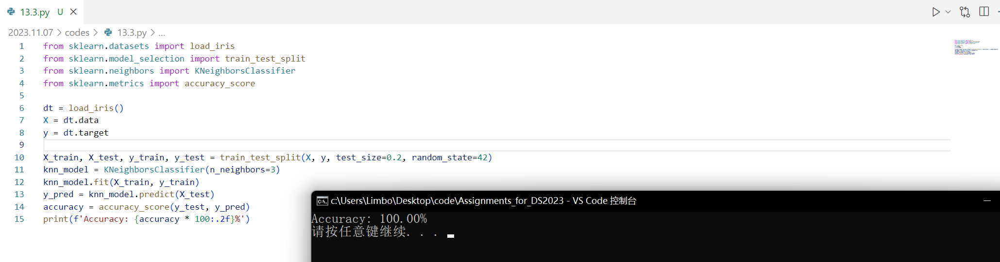

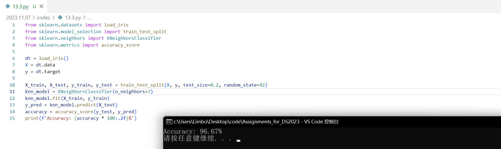

可以看出，选择合适的k值可以增加准确性

## 13.8

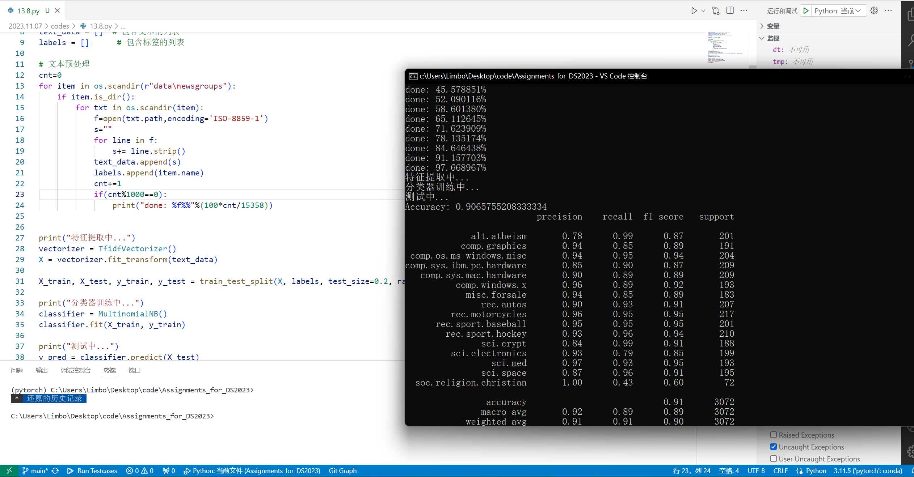

几个注意的点：

- 这个文档有点难搞，我在linux下解压又放回了主机

- 使用`os.scandir`扫描文件夹下文件
- 文件读取，初始化`text_data`,`labels`
- 使用`TF-IDF`作为词袋模型
- 使用朴素贝叶斯分类器

## 14.4实践

#### 14.4.1

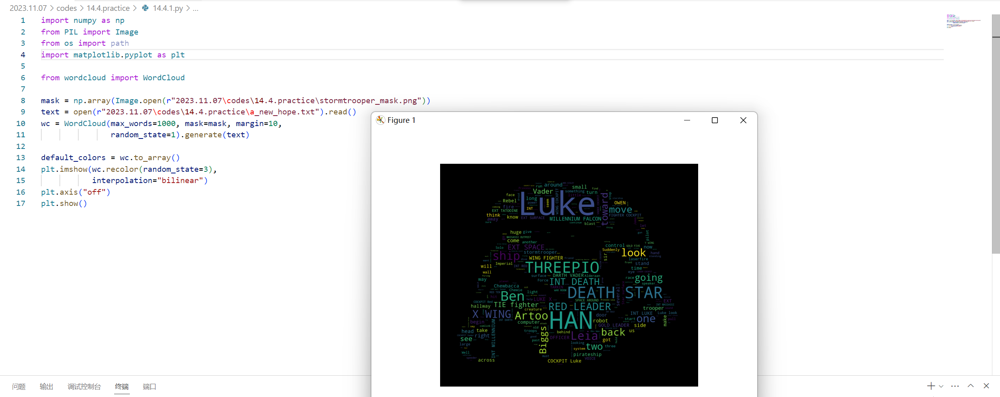

#### 14.4.2

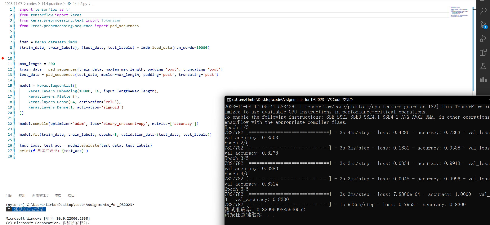

使用keras导入的数据集，已经把单词转数据了，无需调用`Tokenizer`.

## 14.2

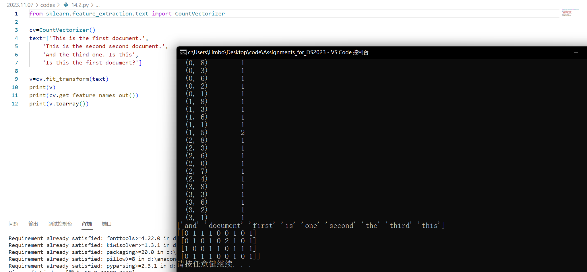

## 14.3

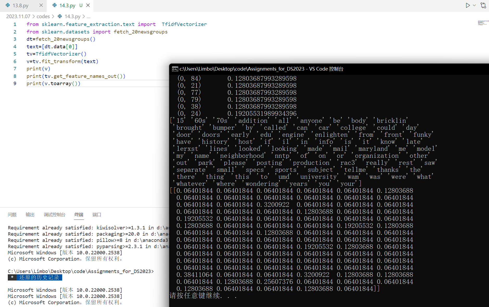

## 14.3

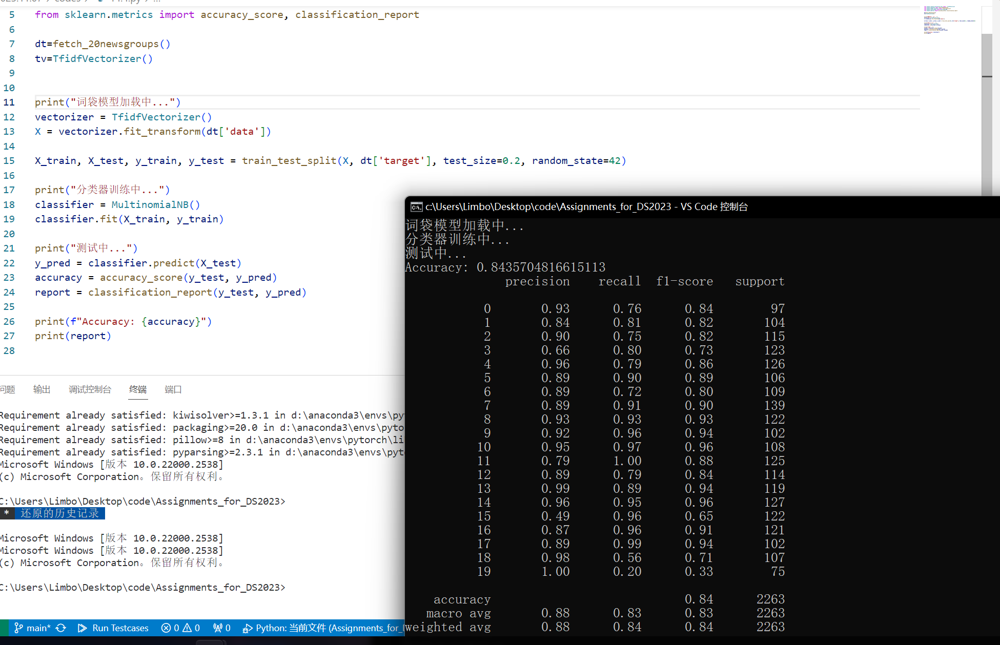

感觉跟13.8有点类似（？

## 14.4

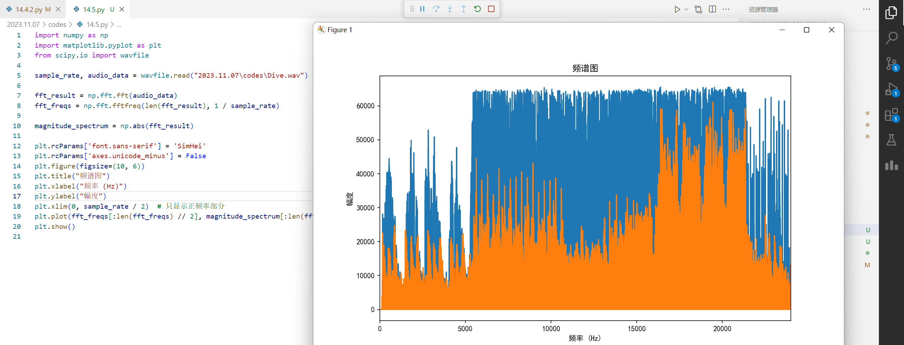

## 14.8&14.9

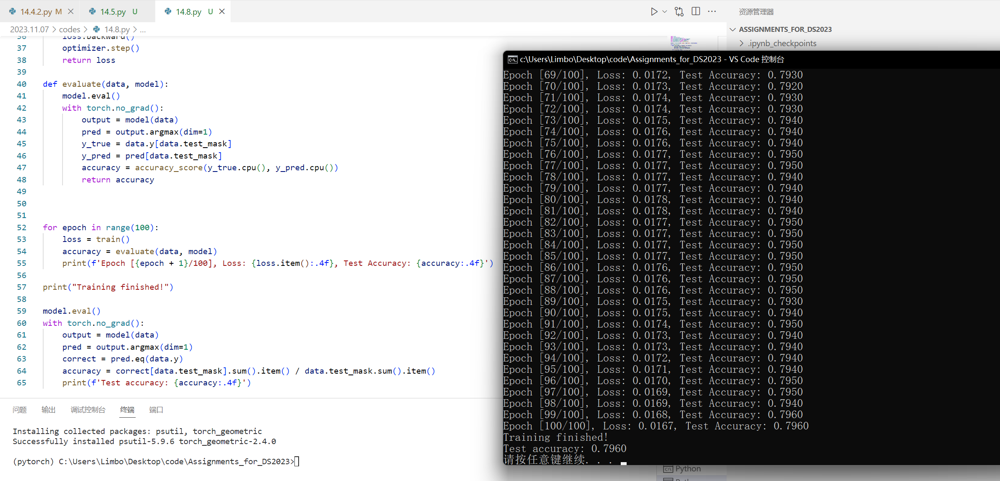

参考代码，使用了`torch_geometric`中的图神经网络（`GNN`）

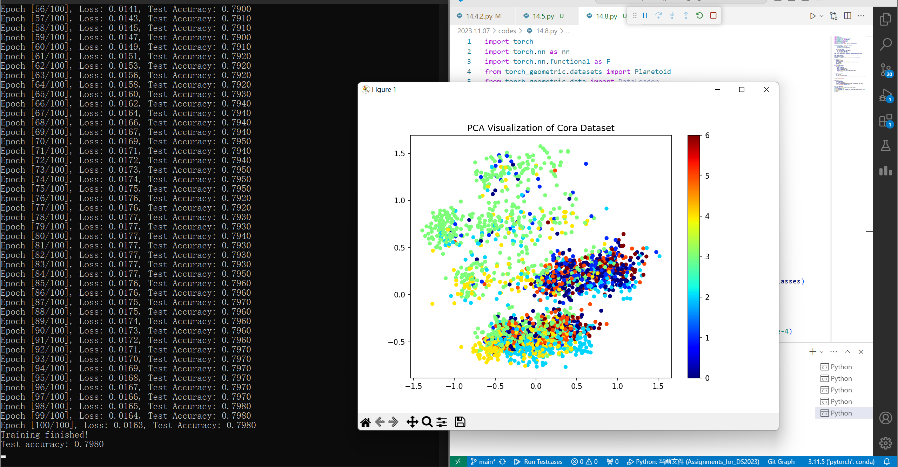

我的二维可视化似乎不是特别直观，不过这个人挺直观的，也许有价值参考（我没太看懂）

[GCN、GAT实现Cora数据集节点分类（pytorch-geometric框架）_节点分类问题用的数据集-CSDN博客](https://blog.csdn.net/qq_20805805/article/details/117720945)

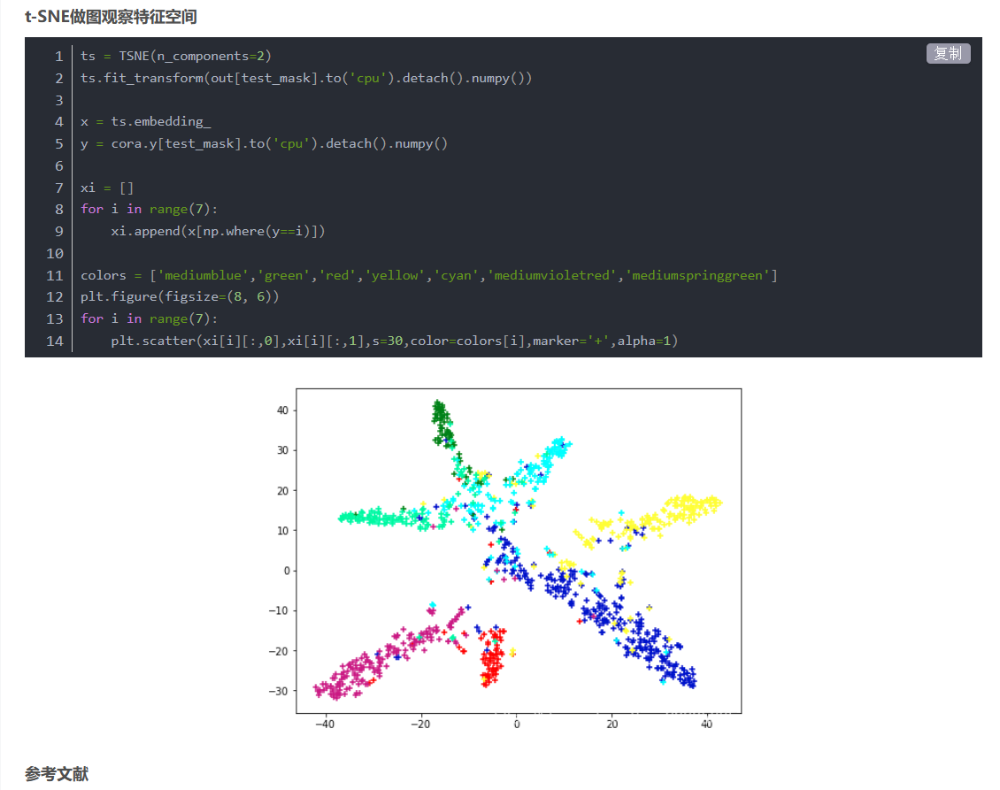
