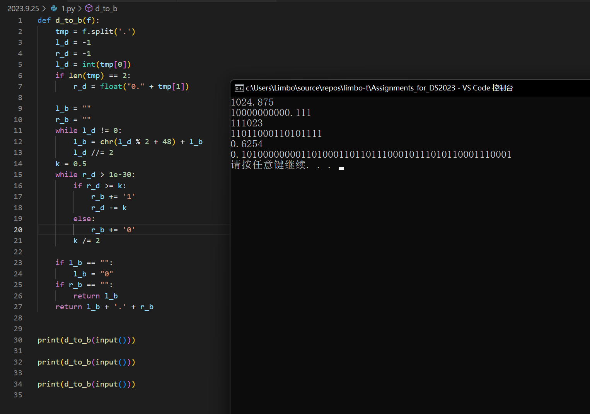
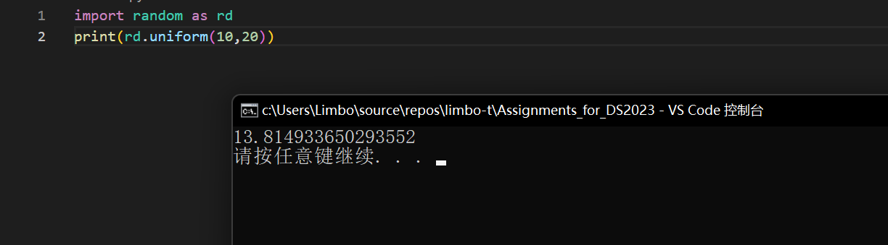
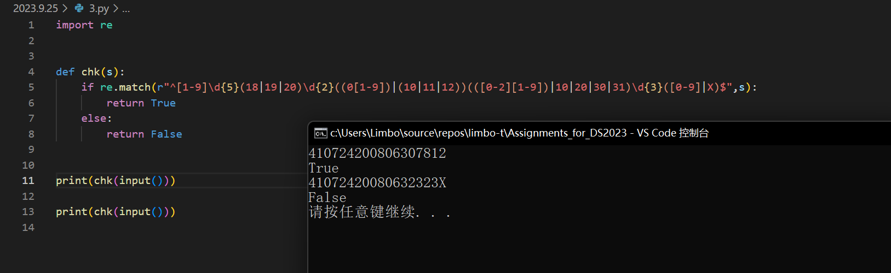
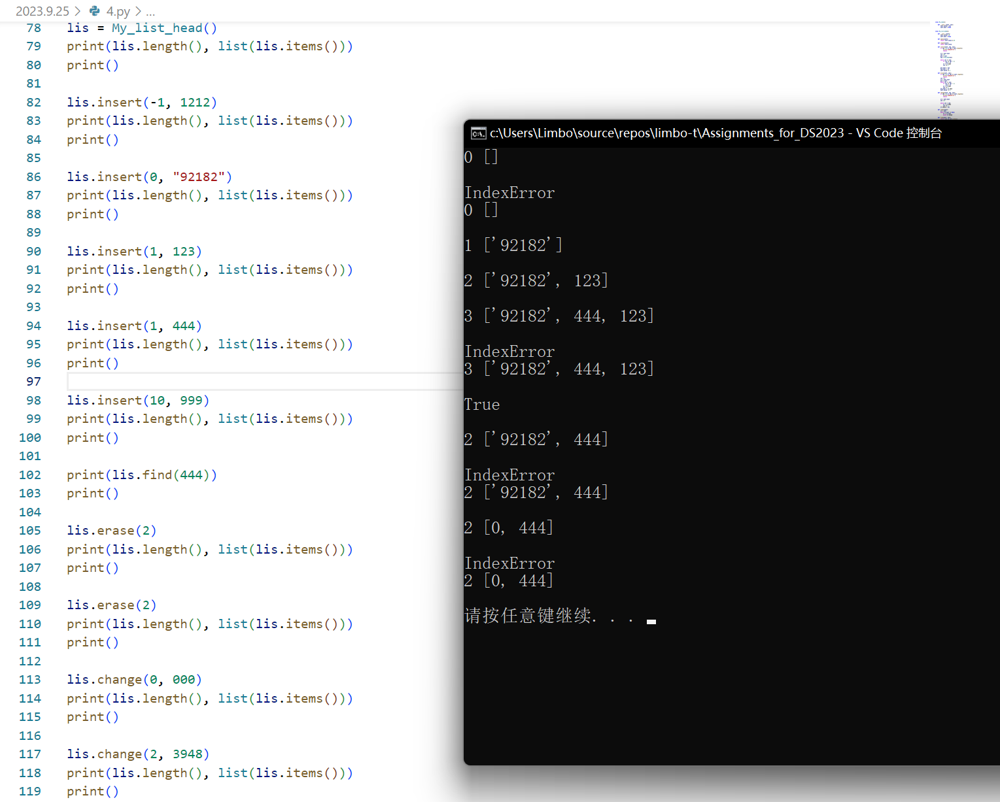
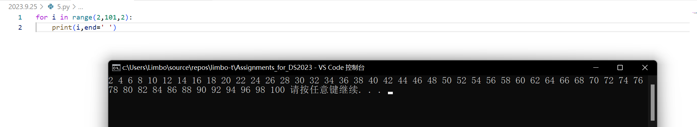
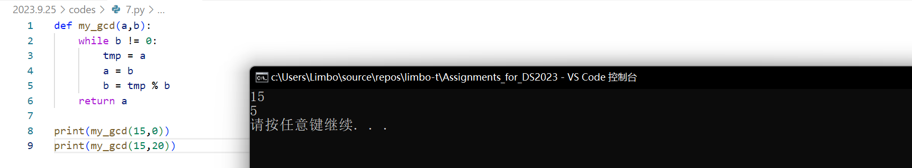
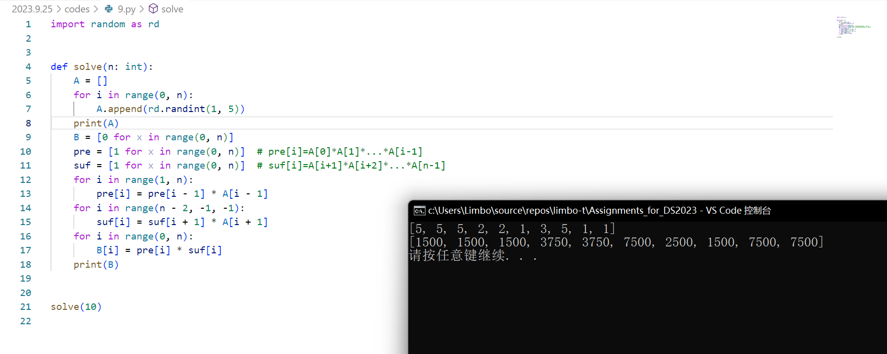

# 题解

## 3.1

PS:可以处理0.X以及无小数的形式及负数

## 3.2

## 3.3

## 3.4

PS:实现的单向链表有一定健壮性，length() 可在O1内获得长度（存储在链表头节点）

## 3.5

## 3.6

## 3.7

## 3.8

观察发现，测试数据量每\*2，冒泡排序花费时间约\*4，快速排序约\*2，符合O($n^2$)与O($nlogn$)

## 3.9

$$
B[i]=\prod_{k=1}^{i-1}A[i]*\prod_{k=i+1}^{n-1}A[i]
$$

