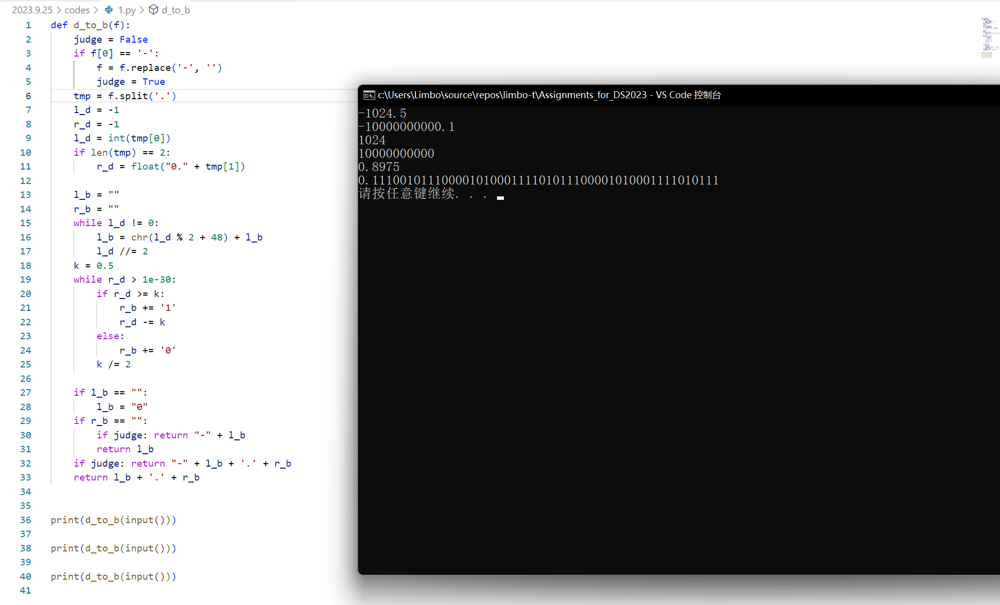
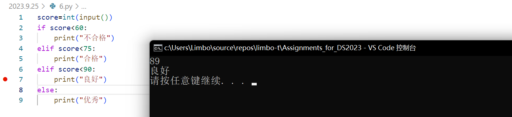
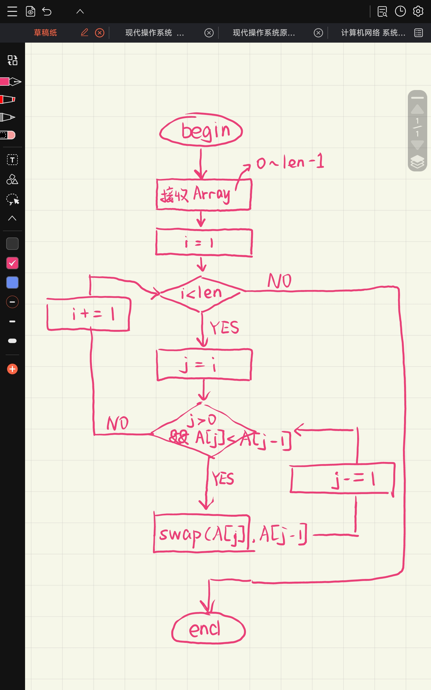

# 题解

## 3.1

PS:可以处理0.X以及无小数的形式及负数



## 3.2


## 3.3


## 3.4

PS:实现的单向链表有一定健壮性，length() 可在O1内获得长度（存储在链表头节点）


## 3.5


## 3.6



## 3.7


## 3.8

观察发现，测试数据量每\*2，冒泡排序花费时间约\*4，快速排序约\*2，符合O($n^2$)与O($nlogn$)


## 3.9

$$
B[i]=\prod_{k=1}^{i-1}A[i]*\prod_{k=i+1}^{n-1}A[i]
$$


## 4.1

使用了Miller Rabin素数判定法，原理为费马小定理及二次检测定理

最坏时间复杂度O($klog^3n$)

在1e18的数据范围下，选取{2, 325, 9375, 28178, 450775, 9780504, 1795265022}七个数作为底数可保证100%正确

此时k为7


## 4.2

```python
import time as tm

beg=tm.time()
fun() #do something
end=tm.time()
print(end-beg)
```

码还是3.8的码


## 4.3



## 4.4


时间复杂度O($n^2$),空间复杂度O($1$)

PS:你确定这个不是选择排序？？？