# 2023年度B站每周必看数据及热点分析

## 简介

毫无疑问，B站是中国年轻人使用的最多的视频类网站（软件）：

根据bilibili 2023年Q1财报显示，B站日均活跃用户已达9,370万，用户日均使用时长达到96分钟。超过150万UP主（即上传视频者的代称）在B站获得收入，月均投稿量超2,200万。

因此，分析B站的每周必看板块的数据以及热点，具有较高的价值。

#### 简要展示

本次作业主要分为两个部分，第一部分使用爬虫获取B站视频信息并保存，第二部分使用dataease进行结果展示与可视化。如下：

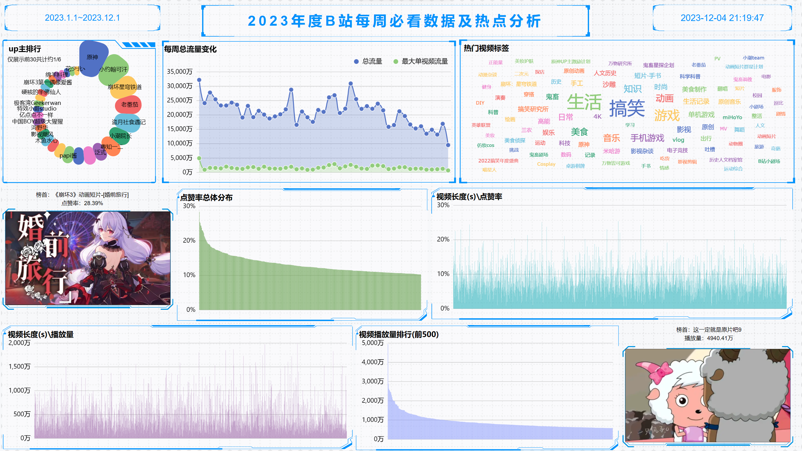

#### 目录

项目目录如下：

三个csv是保存的文件，两个spider是爬虫代码，运行即可获得这三个文件。

## PART1 爬虫

#### spider.py

实现将第198期到第244期每周必看下的视频信息保存为如图（共2047个视频）

时间范围（2022.12.30到 2023.12.1）

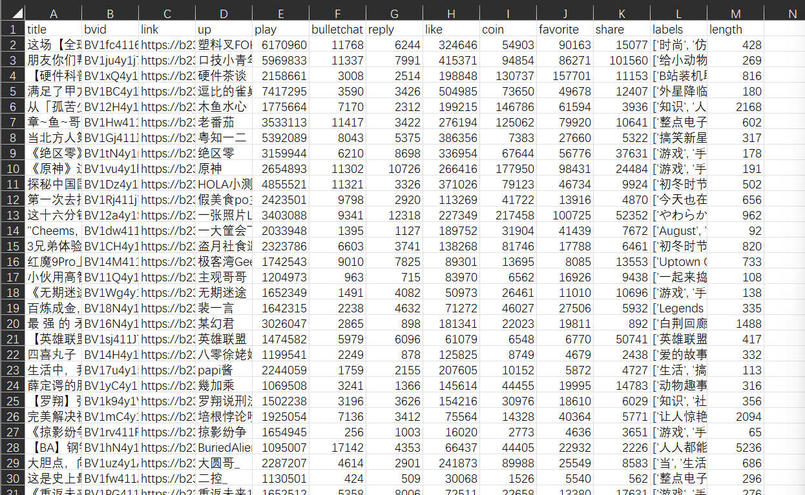

爬取的页面如图：

由于b站每周必看是打开网站后才动态加载的数据，所以直接request此链接是得不到信息的。

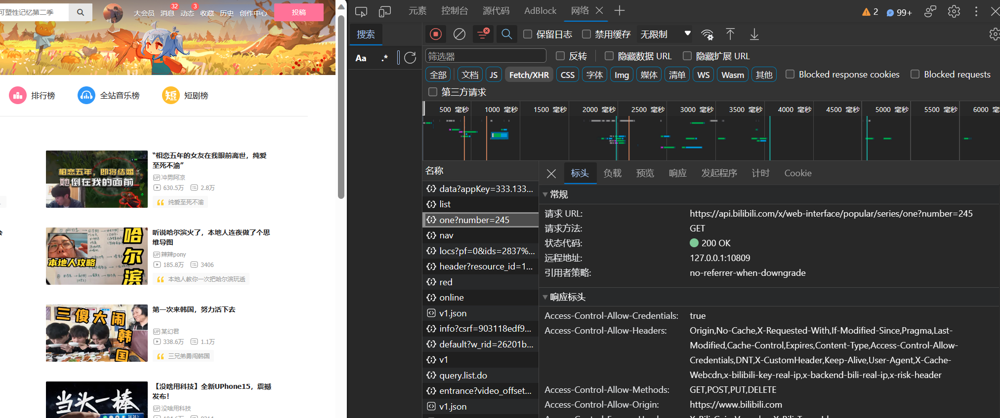

不过，我们可以找到其动态加载调用的api，即

https://api.bilibili.com/x/web-interface/popular/series/one?number=245

request这个链接即可获得想要的数据。

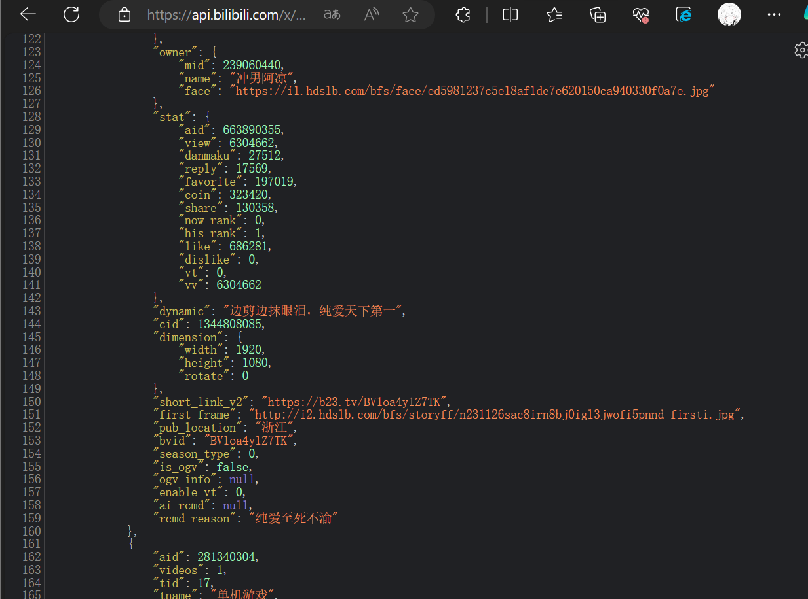

于是在代码实现时，将获取到的html转为json文件后可以快速找到想要的信息，如图。

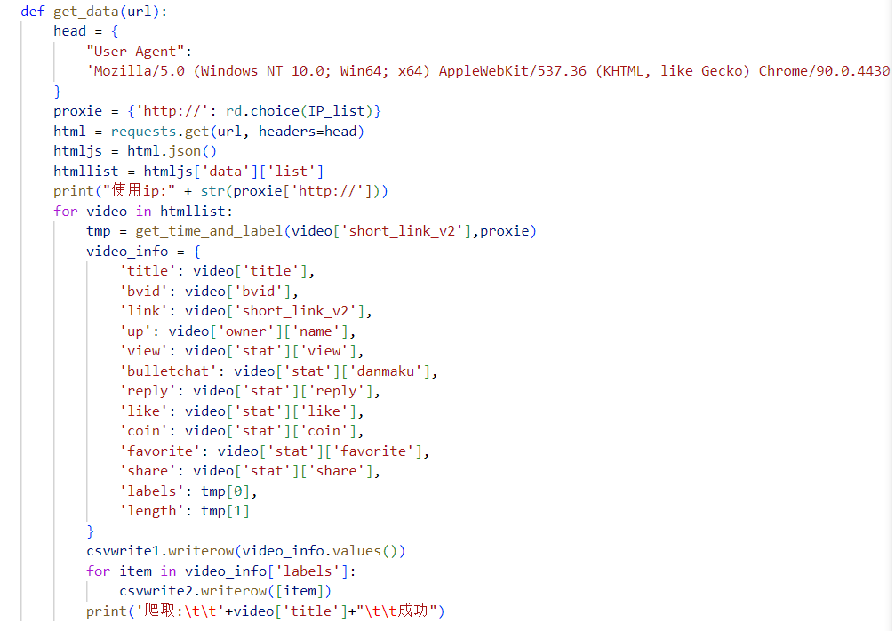

其中，csv1是保存了每个视频的信息，csv2是保存了每个视频的标签，因此可以用于制作词云，反映热门标签

注意到，部分信息比如标签和视频长度并不在这个api中显示，因此需要爬取视频的主页`video['short_link_v2']`，获得对应的信息。

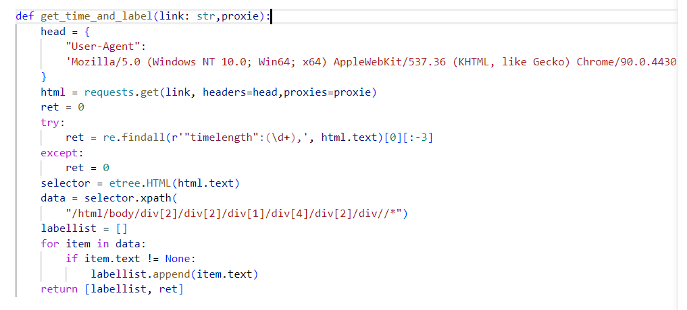

在这个函数中，经过观察，由于这些信息在返回的html中直接包含，因此我尝试正则化匹配`timelength`；使用xpath定位到所有标签。最后返回这些信息。

由于极小部分的链接主页与其他不同，比如拜年祭视频或特殊活动视频，所以这些视频的时长我直接设置为零。

程序运行会打印一些提示信息，如图：

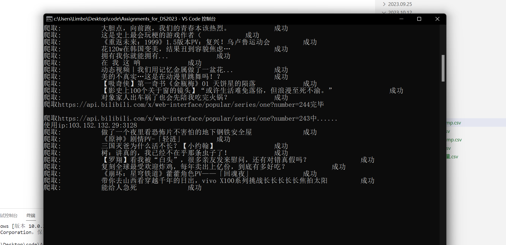

此外，由于b站反爬机制，所以我每次申请的时候选用不同的代理ip，免费的代理ip可以从这个网站获取，不过需要谨慎使用。[Proxy Checker (checkerproxy.net)](https://checkerproxy.net/)

如果你想尝试运行代码，可能需要修改这些免费代理ip。

如果程序运行顺利，可能需要大概20分钟获取到全部的数据。可能是代理ip响应太慢了（

保存的`B站每周必看2023_data.csv`如图

标题、BV号、链接、up主、播放数、弹幕数、回复数、点赞、投币、收藏、分享、标签、时长(s)

保存的`B站每周必看2023_label.csv`如图,共约20000行。

一行保存1个标签。

#### spider_weeks.py

类似上一个爬虫，不过我另外实现了计算一周中所有视频的播放量之和、其中播放量最高的一个视频的播放量、视频标题。用于一些按周进行的统计。

关键代码如图：

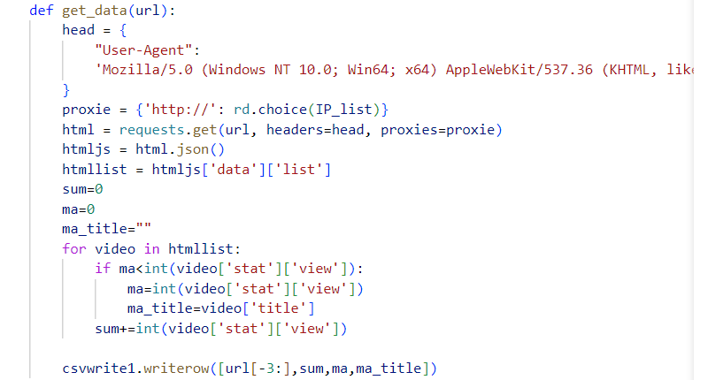

## PART2 dataease可视化及数据分析

#### 总览

看板如图。

#### UP主排行

左上角up主排行

使用上文产生的`B站每周必看2023_data.csv`

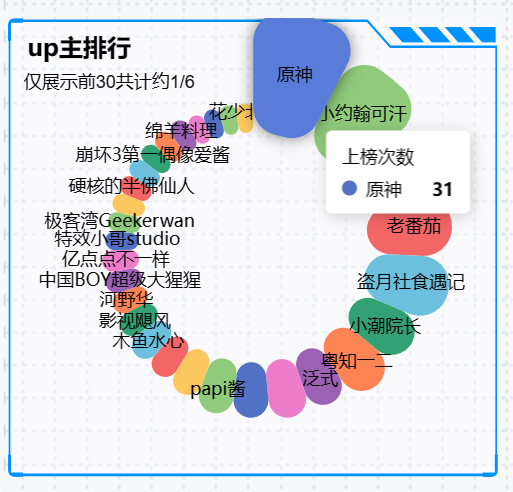

基于其视频在每周必看上榜次数进行排行，一定程度上反馈了up主的受欢迎程度以及被看众认可的程度。

这里仅展示了前30名。

此外，B站年终会评选年度百大UP主，因此我们可以推测其中这三十位UP主有很大概率可以被评上。

#### 每周流量变化

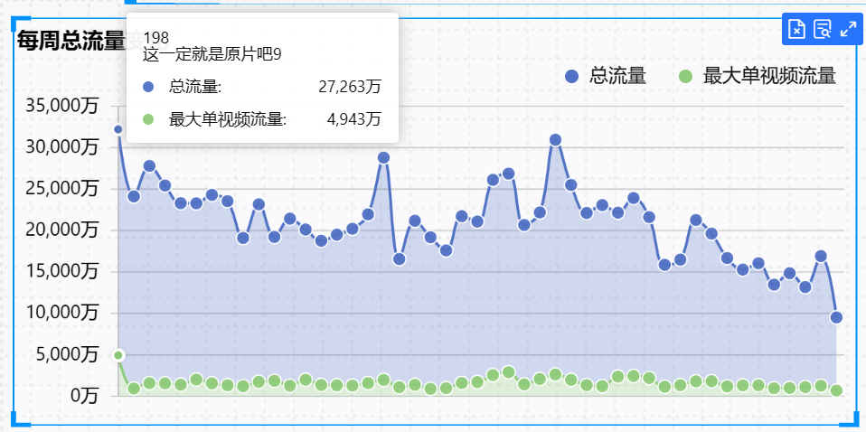

使用上文产生的`B站每周必看2023按周流量.csv`

根据时间先后排序2023初~2023末，单位为周。鼠标悬停在数据点上时，会显示相关信息。

观察图像，大致我们可以得出时间越远的视频，播放量越高。这很合理，因为播放量会随着时间增加。

此外，我们发现，大概今年中旬也就是暑假期间，视频播放量稳定略高。推测可能是因为放假的因素

关于是否可以猜测是B站日活用户减少导致近期视频播放量较低，我认为还需结合其他数据观察。

#### 热门视频标签

使用了`B站每周必看2023_label.csv`

我们观察发现，其中搞笑出现了662次，生活标签出现了645次，游戏429，动画234，剩余的均在200~20之间。

可以推测，目前在B站较受欢迎且存量较多的视频为搞笑类型以及生活类型，其次是游戏类型。确实符合年轻人社区的特征。

如果像让自己的视频登上热门的画，则可以考虑在搞笑和生活方面创作。

#### 点赞率系列

使用`B站每周必看2023_data.csv`

关于点赞率（点赞数➗播放数）的整体分布如图

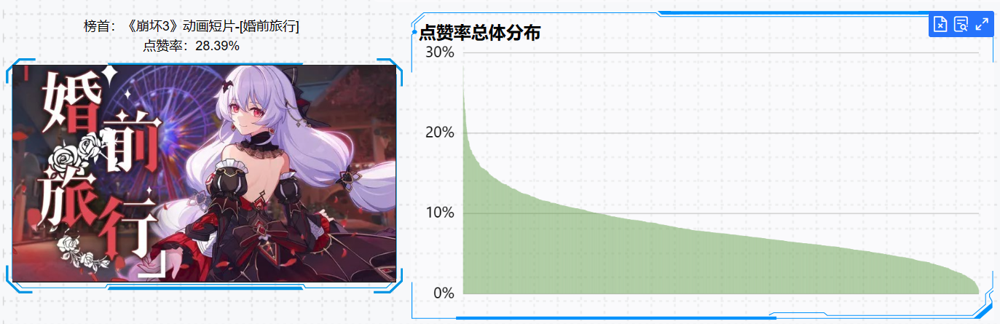

可知，点赞率主要分布在4%到18%。

点赞率在很大程度上反映对于某个视频，观众的喜好和认可程度，无论是视频内容或视频剪辑手法或延申的意义等。

由于B站视频的点赞率大于4%，才会直接给创作者产生收益，所以关注视频点赞率是较为明智的选择。

此外我们发现可能崩坏三玩家对此视频最为喜爱，点赞率高达28%。这对于游戏厂商也有分析的意义。

此外，B站号称以高质量的中长视频作为基本盘，所以我尝试以视频长度（s）来排序，观察点赞率的分布情况，如下。

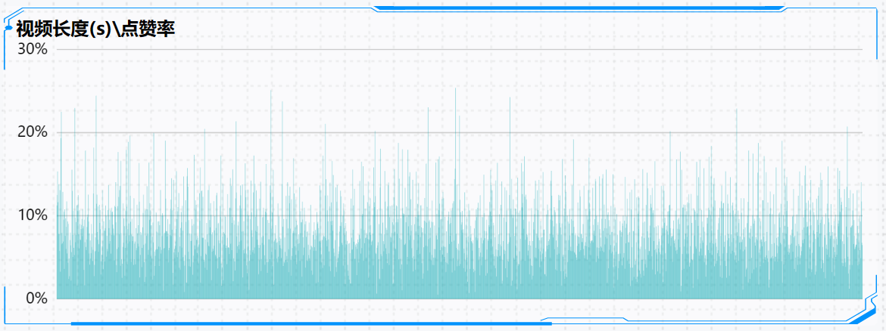

可以从观察到，点赞率基本与视频长度没有关系，各个长度平均可能在9%左右。

因此我们可以得出结论，起码在热门视频_每周必看板块，B站官方并不对长或短的视频有所偏袒，至于全站背景下的长短视频是否存在某些规律，则还需要进一步收集信息来分析。

#### 播放量系列

使用`B站每周必看2023_data.csv`

整体分布如图

播放量主要分布在几十万到数千万之间，总体来看，上了每周必看的视频播放其实都是很高的。

关于位列第一的这个视频，其实它延申出一个2023年初很火的网络热词，`阿里嘎多美羊羊桑`，在当时十分火爆，以至于最终以5000万播放量在此次收集的数据中遥遥领先。虽然今天看来并没有那么好笑了。

link:[这一定就是原片吧9_哔哩哔哩_bilibili](https://www.bilibili.com/video/BV1c3411Q7XH/)

 同样的，我关注了视频时长关于播放量的关系，结果如图：

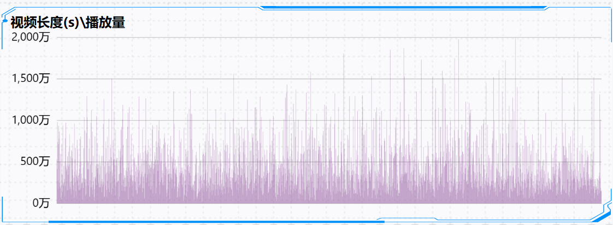

这里略去了播放量大于2000万的少数几个热门视频。

规律并不明显，各段平均值是类似的。

所以验证了在热门视频_每周必看板块，B站官方并不对长或短的视频有所偏袒。

不过我们可以发现，大致来说，随着时长的增加，样本方差增加了，

播放量的变化增加了。

查阅资料，b站播放量的计算方式不是播完一个视频就算一次，而是一个账号一个ip在几个小时内对一个视频只能增加一次播放量。

我推测，对于时长短的视频，用户播放的次数差不多，因为无论视频相当好或是坏，大家都很快看完了，计算一次播放量。

而对于长的视频，若质量更佳，则用户粘性会增加，因此完播率会提高，用户观看时长更高，导致播放量容易更高。而对于质量略逊色的视频，用户完播率更低，或者可能看一眼进度条就切换了下一个视频，导致其中播放量容易更低。

图中大致符合这样的情形，所以出现这种情况很可能有B站计算播放量的机制的原因。

#### 最终展示

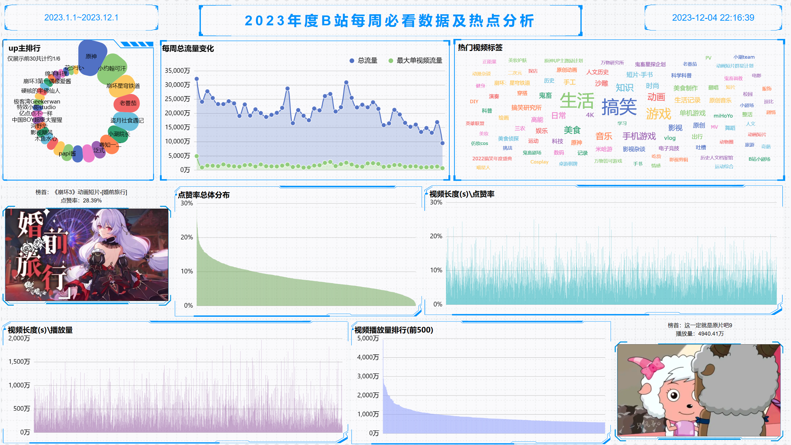